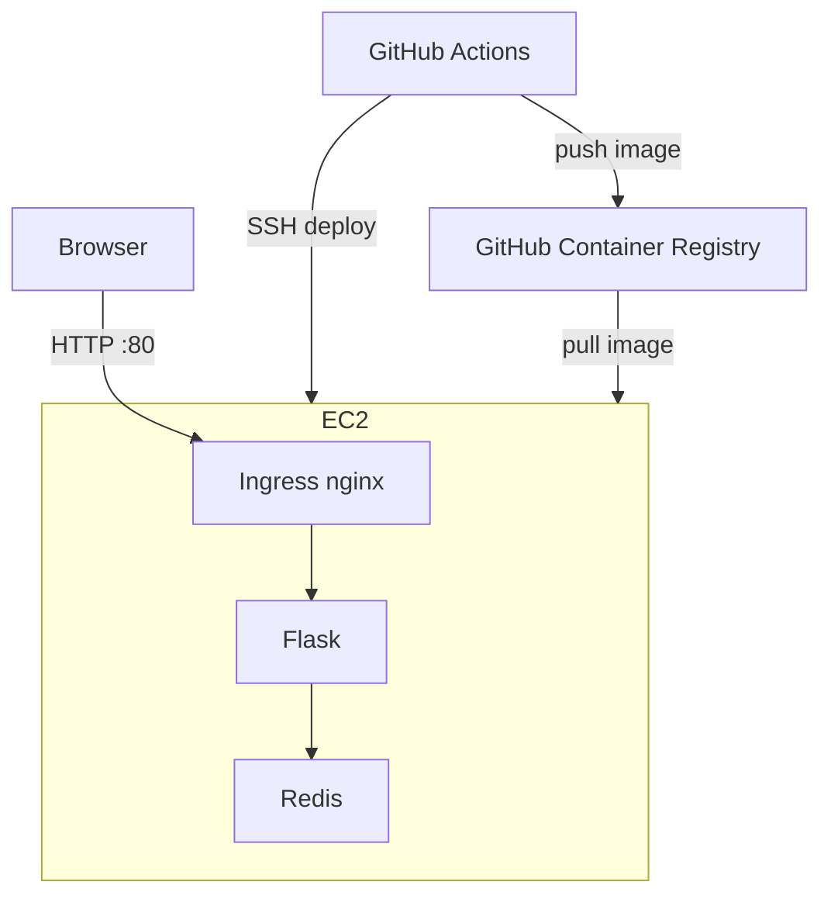
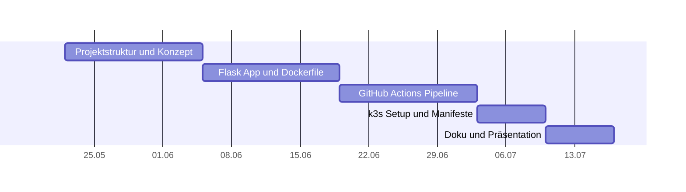

# Projektanforderung – Modul 300

## URL Shortener mit CI/CD-Pipeline und Kubernetes

Lernender: David Martin Felicio Reichlin  
Klasse: PE23e
Lehrperson: Philipp Rohr
Zeitraum: 40 Lektionen  
Repository: https://github.com/reidavid/m300

---

## 1. Ausgangslage

Heutzutage laufen Webapplikationen durch automatisierte Pipelines, die Code testen, containerisieren und in einem
Cluster ausliefern. In diesem Projekt wird dieser Workflow umgesetzt.

Als Beispielapp wird ein kleiner URL-Shortener mit Flask gebaut: Ein Webservice, der lange URLs in kurze Codes umwandelt
und bei Aufruf weiterleitet.

---

## 2. Projektidee und Ziel

Es wird ein URL Shortener mit zwei Komponenten gebaut:

- Flask-App (Python): Nimmt URLs entgegen, gibt Kurzcodes zurück, leitet weiter
- Redis: In-Memory-Datenbank, die die Zuordnung von Code zu URL speichert

Beide Komponenten laufen als separate Pods in einem k3s-Cluster und kommunizieren über Kubernetes-interne Services.
Eine Github Actions CI/CD-Pipeline baut automatisch ein neues Docker-Image und deployed es bei jedem Push auf `main`.

---

## 3. Technologien

| Technologie          | Zweck                                           |
|----------------------|-------------------------------------------------|
| Python / Flask       | Webapplikation (URL Shortener API)              |
| Redis                | Datenspeicher für URL-Mappings                  |
| Docker               | Containerisierung der Flask-App                 |
| Github Actions       | Automatische Pipeline (Build, Test, Deploy)     |
| GHCR                 | Speicherung der Docker-Images                   |
| k3s                  | Lokaler Kubernetes-Cluster                      |
| kubectl              | Verwaltung des Clusters                         |
| Kubernetes Manifeste | Deployment, Service, Ingress, ConfigMap, Secret |

---

## 4. Architektur

---

## 5. Funktionale Anforderungen

### 5.1 Applikation (Flask API)

| Endpunkt   | Methode | Beschreibung                                        |
|------------|---------|-----------------------------------------------------|
| `/shorten` | POST    | Nimmt eine URL entgegen, gibt einen Kurzcode zurück |
| `/<code>`  | GET     | Leitet zur hinterlegten Original-URL weiter         |
| `/health`  | GET     | Antwort: `{"status": "ok"}` - für K8s Health Checks |

### 5.2 Pipeline (Github CI/CD)

| Stage    | Was passiert                                     |
|----------|--------------------------------------------------|
| `test`   | Automatisierte Tests mit pytest                  |
| `build`  | Docker-Image bauen und in Github Registry pushen |
| `deploy` | `kubectl apply` auf den k3s-Cluster              |

Trigger bei jedem Push auf `main`

---

## 6. Zeitplan

| Phase             | Lektionen | Inhalt                                                                                 |
|-------------------|-----------|----------------------------------------------------------------------------------------|
| Planung           | 1–6       | Projektstruktur, Git-Repo aufsetzen, Konzept schreiben, Technologien installieren      |
| Containerisierung | 7–14      | Flask-App entwickeln, Dockerfile, docker-compose, lokale Tests                         |
| CI/CD-Pipeline    | 15–22     | `ci-cd.yml` aufbauen, Tests automatisieren, Image in Registry pushen                   |
| Kubernetes        | 23–32     | k3s aufsetzen, Manifeste schreiben, App deployen, Health Checks, Rolling Update testen |
| Abschluss         | 33–40     | Dokumentation fertigstellen, Reflexion                                                 |

*Modul 300 - Plattformübergreifende Dienste in ein Netzwerk integrieren | Technische Berufsschule Zürich*